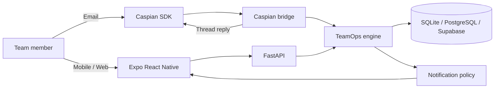

# Caspian TeamOps Sentinel

Caspian TeamOps Sentinel turns team communication into persistent execution memory. A lead can assign work in natural Hinglish, the backend converts it into a validated task, and the responsible member can acknowledge or update it from the app or a Caspian-connected communication channel.

> **Current status:** Hackathon MVP through Phase 4 — foundation, TeamOps message processing, React Native UX, Caspian email transport, and in-app notifications.

## What the project demonstrates

```text
Team message
    ↓
Structured intent and validation
    ↓
Persistent task + deadline + owner
    ↓
Acknowledgement and status tracking
    ↓
Team status, blockers and notifications
```

This is not intended to be another chat interface. The app is the permanent home, FastAPI is the execution brain, the database is the memory, and Caspian is the communication transport.

## Current features

- Team-member directory with permanent roles
- Task creation, assignment, deadlines and status history
- Supported task states:
  - `PENDING_ACK`
  - `TODO`
  - `IN_PROGRESS`
  - `BLOCKED`
  - `DONE`
  - `CANCELLED`
- Deterministic Hinglish task extraction:

  ```text
  Rahul, Monday tak API complete kar dena.
  ```

  becomes:

  ```json
  {
    "intent": "CREATE_TASK",
    "owner": "Rahul",
    "task": "API complete",
    "deadline": "next Monday at 18:00",
    "status": "PENDING_ACK"
  }
  ```

- Acknowledgement and task actions: Accept, Done, Blocked, Help and Snooze
- Database-grounded team queries:
  - `Aaj team ko kya karna hai?`
  - `Rahul ka status kya hai?`
  - `Koi blocker hai?`
- Compact conversation summaries instead of unbounded raw context
- Agent Inbox and commitment board built with Expo/React Native
- Caspian email messages routed through the same TeamOps engine
- In-app notifications with unread/read state
- SQLite zero-configuration mode and PostgreSQL/Supabase compatibility
- Audit records and task-status history

## Architecture



See [architecture.md](./architecture.md) for component boundaries and [flow.md](./flow.md) for end-to-end execution flows.

## Technology stack

| Layer | Technology |
|---|---|
| Mobile/Web | Expo, React Native, Expo Router, TypeScript |
| API | FastAPI, Pydantic |
| Persistence | SQLAlchemy, SQLite or PostgreSQL/Supabase |
| Communication | Caspian Python SDK |
| Testing | Pytest, FastAPI TestClient, TypeScript compiler |

## Repository structure

```text
caspian-ai/
├── backend/
│   ├── app/
│   │   ├── main.py              # FastAPI routes
│   │   ├── teamops.py           # Intent extraction and TeamOps rules
│   │   ├── caspian_bridge.py    # Caspian inbound/reply adapter
│   │   ├── models.py            # SQLAlchemy tables
│   │   ├── schemas.py           # Request/response validation
│   │   └── database.py          # Database configuration
│   ├── tests/
│   ├── requirements.txt
│   └── run_caspian.py
├── mobile/
│   ├── app/                     # Expo Router screens
│   └── src/                     # API client and design tokens
├── .env.example
├── docker-compose.yml
├── architecture.md
├── flow.md
└── README.md
```

## Prerequisites

- Python 3.11+
- Node.js 20+
- npm 10+
- Optional: Docker Desktop for local PostgreSQL
- Optional: Caspian account/project key for real channel testing

## Quick start

### 1. Configure the environment

Copy the example file without committing the real `.env`:

```powershell
Copy-Item .env.example .env
```

Default local configuration:

```env
DATABASE_URL=sqlite:///./teamops.db
CORS_ORIGINS=*
CASPIAN_BASE_URL=https://api.trycaspianai.com
CASPIAN_SENDER_MAP={}
```

`CASPIAN_API_KEY` is only required for a real Caspian listener. Never commit or share it.

### 2. Start the backend

```powershell
cd backend
python -m pip install -r requirements.txt
python -m uvicorn app.main:app --reload
```

Open:

- API health: [http://localhost:8000/health](http://localhost:8000/health)
- Interactive API docs: [http://localhost:8000/docs](http://localhost:8000/docs)

### 3. Start the Expo app

In another terminal:

```powershell
cd mobile
npm install
npm start
```

Press `w` for the browser build, or use an Android/iOS Expo client. The web app normally opens at `http://localhost:8081`.

For a physical phone, point `EXPO_PUBLIC_API_URL` at the computer's LAN address instead of `localhost`.

## Create demo data

Create Rahul:

```powershell
$rahul = Invoke-RestMethod `
  -Method Post `
  -Uri "http://localhost:8000/members" `
  -ContentType "application/json" `
  -Body '{"name":"Rahul","role":"Backend"}'
```

Create a task from natural communication:

```powershell
Invoke-RestMethod `
  -Method Post `
  -Uri "http://localhost:8000/chat" `
  -ContentType "application/json" `
  -Body '{"sender_name":"Ali","message":"Rahul, Monday tak API complete kar dena.","channel":"app"}'
```

Ask for the team plan:

```powershell
Invoke-RestMethod `
  -Method Post `
  -Uri "http://localhost:8000/chat" `
  -ContentType "application/json" `
  -Body '{"sender_name":"Ali","message":"Aaj team ko kya karna hai?","channel":"app"}'
```

## Caspian email integration

Install and initialize the official SDK/CLI, then connect an email channel:

```powershell
python -m pip install caspian-sdk
caspian init
caspian connect email
```

Start the listener in a separate terminal:

```powershell
cd backend
python run_caspian.py
```

The listener uses the same TeamOps engine as `POST /chat`. Incoming messages are parsed, persisted and answered in the original Caspian thread.

Short replies such as `Accepted` require an address-to-member mapping:

```env
CASPIAN_SENDER_MAP={"rahul@example.com":"Rahul","ali@example.com":"Ali"}
```

Do not place real addresses in `.env.example` or documentation.

## Main API endpoints

| Method | Endpoint | Purpose |
|---|---|---|
| `GET` | `/health` | Service health |
| `POST` | `/auth/login` | Demo member login |
| `GET/POST` | `/members` | Team directory |
| `GET/POST` | `/tasks` | Task list and creation |
| `PATCH` | `/tasks/{id}` | Task status update |
| `POST` | `/chat` | TeamOps message processing |
| `GET` | `/team/status` | Team-level counts |
| `GET/POST` | `/dependencies` | Task dependency records |
| `GET/POST` | `/events` | Normalized external events |
| `GET` | `/notifications` | Notification inbox |
| `PATCH` | `/notifications/{id}/read` | Mark notification read |

## Validation

Backend tests:

```powershell
cd backend
python -m pytest -q
```

Mobile type check:

```powershell
cd mobile
npm run typecheck
```

Web production bundle:

```powershell
cd mobile
npx expo export --platform web
```

## Security boundaries

- `.env`, local databases, caches and build artifacts are ignored by Git.
- Caspian/API credentials are loaded from environment variables only.
- Raw credentials must never be stored in TeamOps memory.
- The current MVP performs no autonomous production changes.
- Credential rotation and destructive actions remain human-approved future work.
- ContextFence secret detection is planned for Phase 5.

## Current limitations

- The deterministic parser supports the primary hackathon English/Hinglish patterns, not arbitrary natural language.
- Demo authentication is not production authentication.
- Help marks the current task blocked; extension requests do not change deadlines without approval.
- Sender mapping is configured manually for channel identities.
- Dependency risk propagation, ContextFence and GitHub webhook intelligence are planned for Phase 5.

## Roadmap

- **Phase 5:** dependency propagation, ContextFence and GitHub CI events
- **Phase 6:** end-to-end demo hardening, deployment and rehearsal
- Later: richer identity management, production authentication, migrations and additional channels

## License

Add a license before public production distribution. Third-party packages remain subject to their own licenses, including the Caspian SDK.
