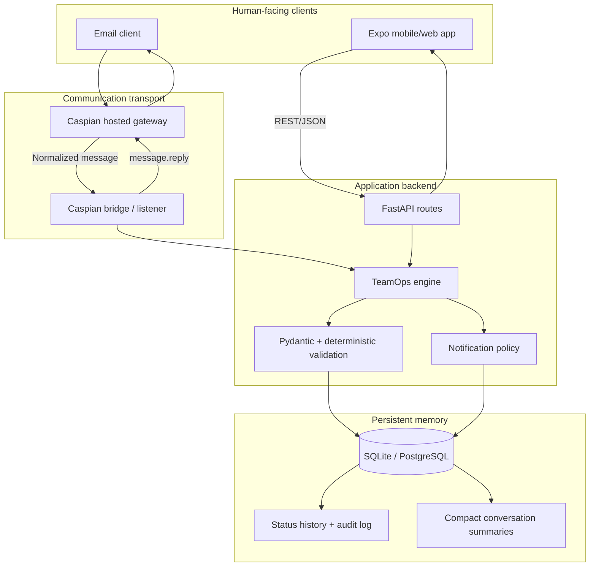
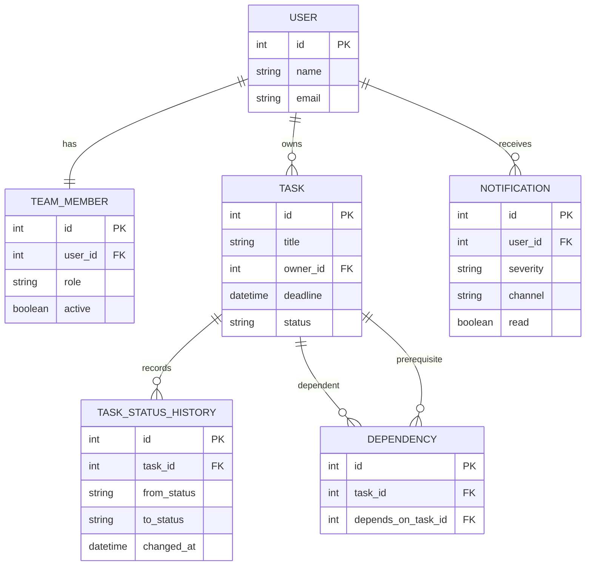
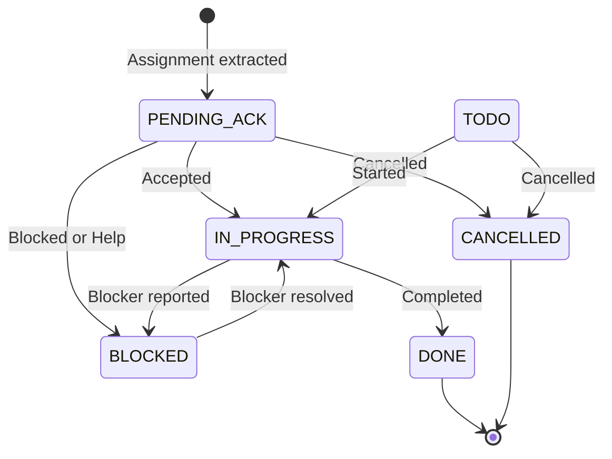
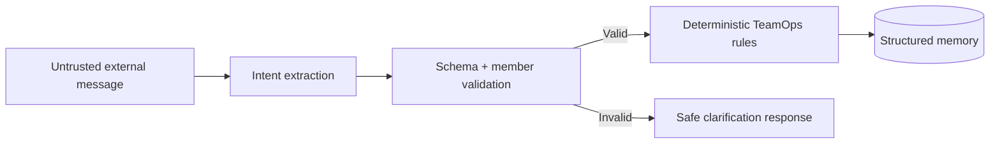

# Architecture

## System objective

Caspian TeamOps Sentinel converts human communication into validated operational state. Natural-language input never writes directly to the database: it is classified, structured, checked against the team directory and then handled by deterministic TeamOps rules.

The architecture separates four responsibilities:

1. **Home:** Expo/React Native presents tasks, risks and actions.
2. **Brain:** FastAPI and the TeamOps engine apply execution rules.
3. **Memory:** SQLAlchemy persists members, commitments, history and summaries.
4. **Transport:** Caspian receives and replies on human communication channels.

## Component view

## Backend modules

### `main.py`

The HTTP boundary. It exposes health, members, tasks, chat, events, dependencies, team status and notifications. Routes validate payloads and delegate message intelligence to the TeamOps engine.

### `teamops.py`

The operational brain:

- Normalizes incoming text
- Extracts supported intents
- Resolves owners against permanent team memory
- Converts weekday deadlines to exact datetimes
- Applies task state transitions
- Answers team queries from current database state
- Writes compact conversation summaries
- Generates notification records

The language layer is not trusted as a source of team truth. Answers are generated from the database.

### `caspian_bridge.py`

The transport adapter:

- Loads Caspian configuration from the root `.env`
- Receives normalized messages
- Maps external addresses to internal member names
- Calls the same TeamOps engine used by `/chat`
- Replies through `message.reply()` in the original channel/thread

Caspian does not own permanent memory or duplicate business rules.

### Persistence modules

`models.py` defines structured memory, `schemas.py` validates API contracts, and `database.py` selects SQLite or PostgreSQL using `DATABASE_URL`.

## Data model

| Table | Responsibility |
|---|---|
| `users` | Human identity |
| `team_members` | Permanent role and active state |
| `tasks` | Current commitment state |
| `task_status_history` | Transition history |
| `dependencies` | Task prerequisite edges |
| `events` | Normalized external events |
| `conversation_summaries` | Compact channel memory |
| `notification_preferences` | Preferred delivery behavior |
| `notifications` | In-app delivery records |
| `audit_logs` | Important entity actions |

## Task state model

The MVP's manual task endpoint accepts every declared state. Production hardening should enforce allowed transitions server-side.

## Trust boundaries

- External text is untrusted.
- Ownership must resolve against the team directory.
- Unsupported messages do not mutate tasks.
- Credentials live only in environment configuration.
- Caspian is a transport, not an authorization source.
- Phase 5 ContextFence will add secret detection and forwarding policy.

## Deployment modes

### Local hackathon mode

- FastAPI and the Caspian listener run as local Python processes.
- SQLite provides zero-setup persistence.
- Expo serves the web/mobile client.

### Hosted mode

- FastAPI and the listener run as services.
- `DATABASE_URL` points to PostgreSQL/Supabase.
- Expo uses the hosted API address.
- Secrets are configured in the hosting platform.

## Key design decisions

- **Deterministic fallback:** the core demo works without an LLM key.
- **One engine for every channel:** REST chat and Caspian both call `process_message`.
- **Structured summaries:** operational outcomes are stored instead of unlimited raw context.
- **Portable storage:** SQLite supports local demos; PostgreSQL supports hosted deployments.

## Planned Phase 5 extensions

- Dependency risk propagation
- ContextFence secret scanning and safe alerts
- GitHub webhook verification and CI-failure normalization
- Context-aware recipient selection
- Database migration strategy

