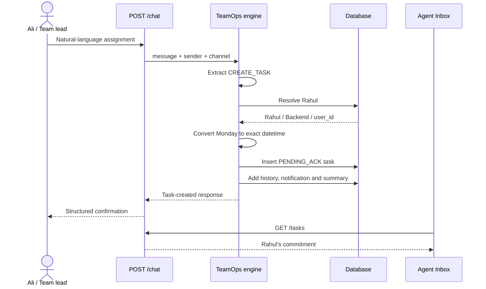
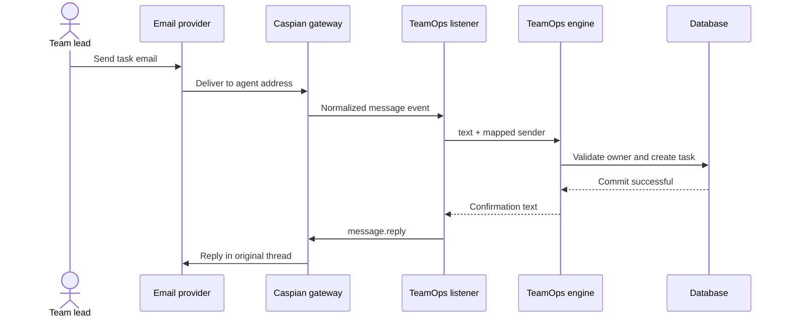
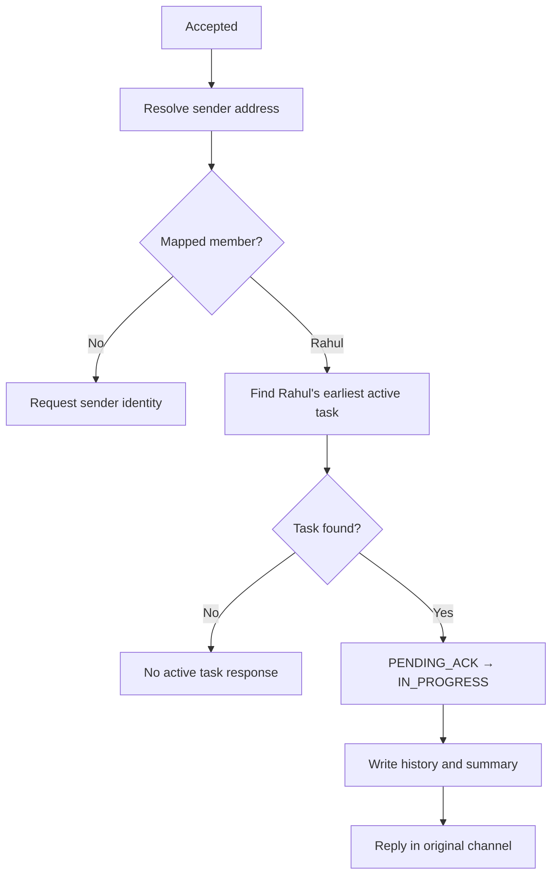
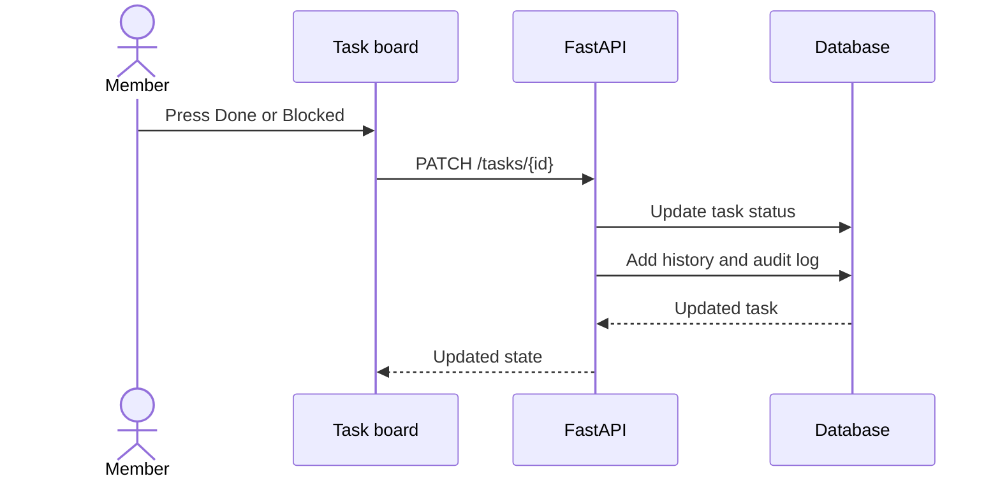
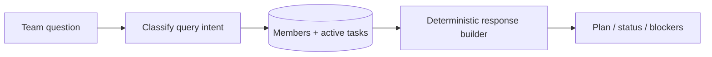
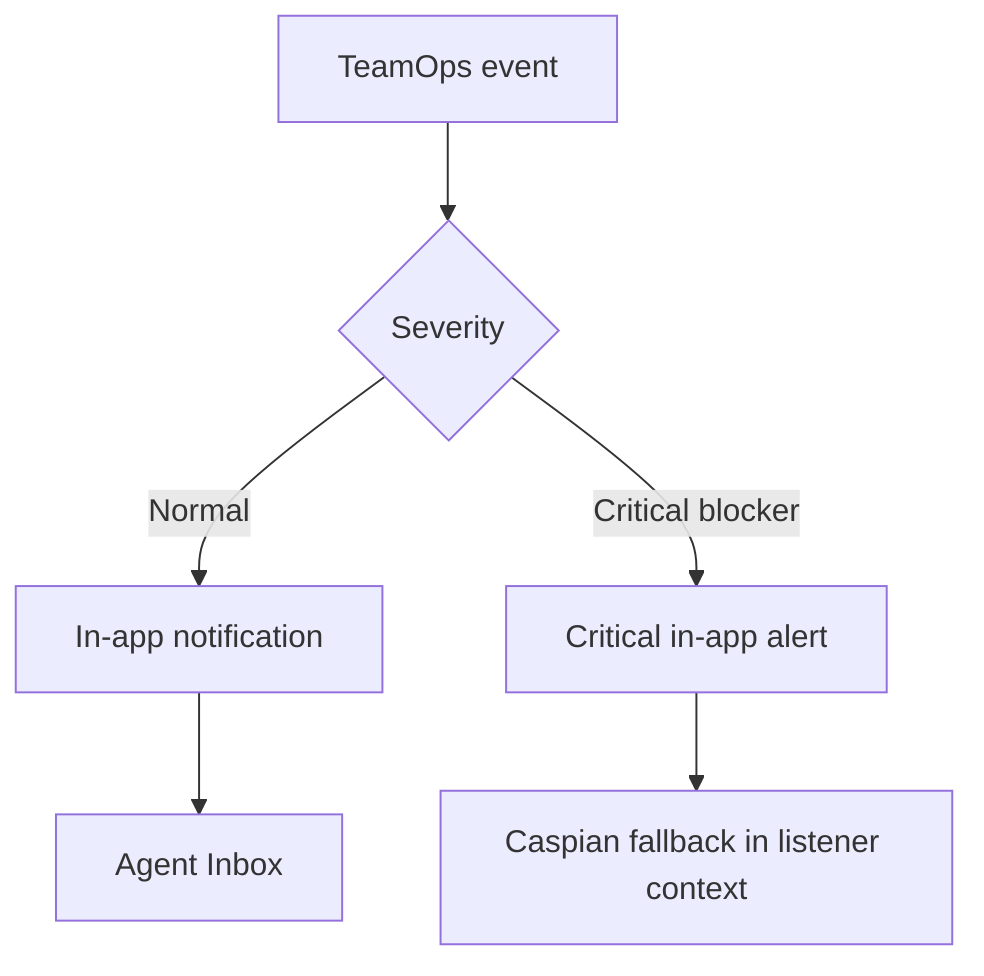
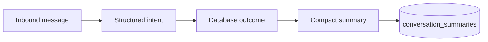

# Application Flows

This document explains how data moves through Caspian TeamOps Sentinel and what a user should observe.

## 1. Task assignment

Input:

```text
Rahul, Monday tak API complete kar dena.
```



Stored result:

| Field | Value |
|---|---|
| Owner | Rahul |
| Task | API complete |
| Deadline | Next Monday at 18:00 |
| Status | `PENDING_ACK` |

## 2. Caspian email flow



The commitment board shows structured task state rather than a raw-email transcript.

## 3. Acknowledgement flow

Rahul replies `Accepted`. Short channel replies require Rahul's address in `CASPIAN_SENDER_MAP`.



## 4. Task-board actions

| Action | Behavior |
|---|---|
| Done | Selected task becomes `DONE` |
| Blocked | Selected task becomes `BLOCKED` |
| Help | Assistance is requested and the active task becomes blocked |
| Snooze | Extension is requested; deadline remains unchanged pending approval |



## 5. Database-grounded queries

Supported questions:

```text
Aaj team ko kya karna hai?
Rahul ka status kya hai?
Koi blocker hai?
```



The response builder cannot invent tasks or blockers because it reads current database records.

## 6. Notification flow



Phase 5 will use dependency data to notify only affected people.

## 7. Conversation memory



The MVP stores classified outcomes instead of unbounded raw chat context.

## 8. Safety and error flows

### Unknown owner

If a message assigns work to someone outside the directory, no task is created and the response identifies the missing member.

### Unsupported message

The intent becomes `UNKNOWN`, no task mutation occurs, and the user receives safe guidance.

### Missing sender identity

Assignments can name their owner inside the message. Short updates such as `Accepted` cannot safely select a member without an address mapping.

### Missing Caspian key

FastAPI and the app continue working locally. The Caspian listener exits with a setup error and never uses a fallback credential.

## 9. Five-minute demo

1. Show Rahul, Neha, Sumeet and Ali in the directory.
2. Send `Rahul, Monday tak API complete kar dena.` through Caspian email.
3. Show the `PENDING_ACK` card.
4. Reply `Accepted` as mapped Rahul and show `IN_PROGRESS`.
5. Ask `Aaj team ko kya karna hai?` and show the database-grounded plan.
6. Mark a task blocked and show the risk signal.
7. Phase 5 adds dependency propagation, GitHub CI failure and ContextFence.

